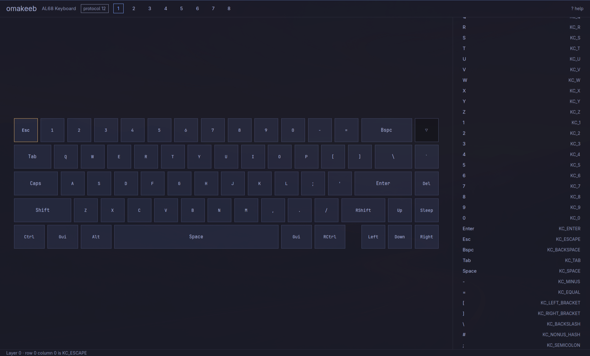

# omakeeb

**Remap your VIA keyboard on Omarchy, without opening a browser.**

omakeeb is a small native app for keyboards that run [VIA](https://usevia.app/)-enabled QMK firmware. Plug in your keyboard, click a key, choose what it should do, and the change is live on the keyboard right away. It follows your Omarchy theme, and you can drive it entirely from the keyboard.



- **Remap any key on any layer.** Every layer your firmware has is one click (or one number key) away.
- **Changes are saved on the keyboard itself.** There is no "save" or "flash" step, and the keyboard keeps typing while you work.
- **Set it up once per keyboard.** omakeeb remembers each keyboard's layout, so the next time you plug it in, it opens straight to the keymap.
- **Lighting too.** Brightness, effect, speed and colour, for keyboards whose layout file declares a lighting menu.
- **Safe by default.** Anything drastic (resetting the keymap, clearing memory, entering the bootloader) asks before it happens.

## Contents

- [Install](#install)
- [First run](#first-run)
- [Everyday use](#everyday-use)
- [Keyboard shortcuts](#keyboard-shortcuts)
- [Troubleshooting](#troubleshooting)
- [Update and uninstall](#update-and-uninstall)
- [What it doesn't do yet](#what-it-doesnt-do-yet)
- [Develop](#develop)

## Install

### What you need

- **Omarchy** (or any Wayland or X11 desktop with a GPU; the plugin and bar button are Omarchy-only).
- **A keyboard with VIA support.** If it works at [usevia.app](https://usevia.app/), it works here.
- **Sudo access, once.** The first install asks for your password to let you open VIA keyboards. See [why](#why-it-asks-for-your-password).
- **Rust 1.97 or newer** to build omakeeb. If `cargo --version` prints nothing, install it with:

  ```sh
  sudo pacman -S rustup && rustup default stable
  ```

### Option 1: Omarchy plugin (recommended)

```sh
omarchy plugin add git@github.com:zythosec/omakeeb.git --enable
```

Always add the plugin with the SSH URL (`git@github.com:zythosec/omakeeb.git`), not the HTTPS one.

A keyboard icon appears on the right of your top bar. **Click it once to finish installing.** A terminal opens, builds omakeeb (a few minutes the first time), and asks for your password once so omakeeb can talk to keyboards. After that, the icon just opens omakeeb, and omakeeb also shows up in the apps menu (<kbd>Super</kbd> + <kbd>Alt</kbd> + <kbd>Space</kbd>).

> **Why the extra click?** Omarchy never runs a plugin's code while installing it, so nothing is built and no password is asked for until you ask for it.

### Option 2: Build it yourself

```sh
git clone git@github.com:zythosec/omakeeb.git
cd omakeeb
make install
```

This installs omakeeb into `~/.local` (the program, an app-launcher entry and an icon) and asks for your password once, for the same keyboard access. It doesn't add the bar icon; use Option 1 if you want that.

### Why it asks for your password

Both options ask for your sudo password **once per computer**, and only for keyboard access. Building and installing omakeeb itself happens in your home folder and never needs root.

Linux only lets root open raw keyboard devices. omakeeb installs a small udev rule (`/etc/udev/rules.d/50-omakeeb.rules` and `/usr/lib/udev/omakeeb-hid`) that gives the person sitting at the computer access to **VIA keyboards only**, and to nothing else. omakeeb itself never runs as root. Once the rule is in place, updates and rebuilds don't ask again; only removing it (for example with the uninstall script) means you'll be asked next time.

It talks to the keyboard through the kernel's `hidraw` interface, not libusb, so the keyboard keeps typing normally while omakeeb is open.

## First run

1. **Plug in your keyboard** and open omakeeb. If it's already open, it notices the keyboard on its own.
2. **Give it the keyboard's layout file, once.** VIA keyboards don't tell the computer where their keys physically sit, so the first time you plug one in, omakeeb asks for its *definition*: a `.json` file from the manufacturer. Press <kbd>Enter</kbd> (or click **Choose definition…**) and pick the file.

   **Where to find it:** check the manufacturer's product or download page (search for "VIA JSON"), or look for your keyboard in the [VIA keyboards repository](https://github.com/the-via/keyboards/tree/master/v3).

3. **That's it.** omakeeb saves a copy of the file under your keyboard's USB ids in `~/.config/omakeeb/definitions/`, so it won't ask again for this keyboard.

**Just want to look around?** Run `omakeeb --demo` to open a sample 60% keyboard with nothing plugged in.

## Everyday use

**To change a key:**

1. Pick a layer with the numbered buttons at the top, or press <kbd>1</kbd>–<kbd>8</kbd>.
2. Click the key you want to change, or move to it with the arrow keys.
3. Press <kbd>Enter</kbd> and start typing to filter the list (for example `vol`, `home` or `mo(`), or click a category such as **Media** or **Layers**.
4. Click a keycode or press <kbd>Enter</kbd>. The key changes on your keyboard straight away.

**Reading the keyboard picture:**

| On a key | Means |
| --- | --- |
| `▽` | *Transparent*: falls through to the same key on the layer below |
| blank | Does nothing |
| accent-coloured | Switches layers |
| highlighted outline | The key you have selected |

**Macros.** Click the **Macros** category to see every macro and what it types. Click a row to put that macro on the selected key, or click its pencil (or press <kbd>M</kbd>) to write what it types. <kbd>Tab</kbd> moves to the next macro, <kbd>Enter</kbd> saves it on the keyboard and <kbd>Esc</kbd> closes without saving. Macros use VIA's syntax:

| Write | To |
| --- | --- |
| `Hello` | type the text |
| `{KC_ENTER}` | tap a key |
| `{+KC_LSFT}` … `{-KC_LSFT}` | hold a key, then release it |
| `{KC_LCTL,KC_C}` | press keys together |
| `{250}` | wait 250 ms |
| `\{` `\\` | type a literal brace or backslash |

All macros share one space on the keyboard. The editor shows how much is used and won't save a macro that doesn't fit. Macros can only press basic keys (letters, modifiers, Enter and so on), not layer keys. Anything another tool wrote that omakeeb doesn't edit, such as Vial's extended actions, is shown as `{raw:…}` and kept as it was.

**Layout options.** If your keyboard supports options such as split backspace or ISO enter, they appear as buttons at the top of the right-hand panel. Choose the ones that match your physical keyboard.

**Backing up.** <kbd>Ctrl</kbd> + <kbd>S</kbd> writes a copy of the current keymap to `~/.config/omakeeb/keymaps/`. omakeeb doesn't load these back in yet; they are a record you can keep.

**Small windows.** omakeeb adapts to whatever tile Hyprland gives it: the panel moves under the keyboard, and at very small sizes the keyboard scrolls sideways. If you'd rather it always open as a big floating window, add this to `~/.config/hypr/hyprland.lua`:

```lua
o.window("^omakeeb$", { float = true, center = true, size = { 1280, 800 } })
```

## Keyboard shortcuts

Press <kbd>?</kbd> in the app to see these at any time.

| Keys | Action |
| --- | --- |
| <kbd>←</kbd> <kbd>→</kbd> <kbd>↑</kbd> <kbd>↓</kbd> | Move between keys |
| <kbd>1</kbd> – <kbd>8</kbd> | Choose a layer |
| <kbd>Enter</kbd> | Open the keycode list for the selected key |
| *type* | Filter the keycode list |
| <kbd>↑</kbd> <kbd>↓</kbd>, then <kbd>Enter</kbd> | Choose a keycode from the list |
| <kbd>Tab</kbd> / <kbd>Shift</kbd> + <kbd>Tab</kbd> | Next / previous keycode category |
| <kbd>Esc</kbd> | Close the keycode list |
| <kbd>M</kbd> | Edit macros (the selected key's, if it plays one) |
| <kbd>-</kbd> <kbd>=</kbd> | Lighting brightness down / up |
| <kbd>[</kbd> <kbd>]</kbd> | Previous / next lighting effect |
| <kbd>;</kbd> <kbd>'</kbd> | Lighting colour (hue) |
| <kbd>Shift</kbd> + <kbd>-</kbd> <kbd>=</kbd> | Lighting effect speed |
| <kbd>Ctrl</kbd> + <kbd>S</kbd> | Save a backup of the keymap |
| <kbd>Ctrl</kbd> + <kbd>=</kbd> <kbd>-</kbd> <kbd>0</kbd> | Zoom in / out / reset |
| <kbd>R</kbd> | Look for keyboards again |
| <kbd>?</kbd> | Show all shortcuts |
| <kbd>Q</kbd> | Quit |

## Troubleshooting

<details>
<summary><b>"No VIA keyboard" even though mine is plugged in</b></summary>

- Make sure the keyboard's firmware has VIA enabled. Many keyboards ship with it on; others need VIA firmware flashed first. If [usevia.app](https://usevia.app/) can't see it either, it's the firmware.
- Wireless keyboards usually need to be **plugged in with a cable**. VIA doesn't work over Bluetooth or most 2.4 GHz dongles.
- If you have just installed omakeeb, **unplug the keyboard and plug it back in** so the new permissions apply, then press <kbd>R</kbd>.
</details>

<details>
<summary><b>It keeps asking for permission, or says it can't open the keyboard</b></summary>

The keyboard-access rule isn't installed. Run this, enter your password, then unplug the keyboard and plug it back in:

```sh
~/.local/lib/omakeeb/setup --root-only
```
</details>

<details>
<summary><b>The keys are in the wrong places</b></summary>

The definition file doesn't match your keyboard, or a layout option (split backspace, ISO enter and so on) is set wrong. Try the layout buttons in the right-hand panel first. To start over with a different file, delete the saved copy in `~/.config/omakeeb/definitions/` (it's named after the keyboard's USB ids, for example `3434-0231.json`) and plug the keyboard back in.
</details>

<details>
<summary><b>I clicked the bar icon and nothing happened</b></summary>

The first click opens a terminal and builds omakeeb. If the build fails, the terminal shows why. The most common cause is Rust not being installed; see [What you need](#what-you-need). Builds started without a terminal write their output to `~/.local/state/omakeeb/setup.log`.
</details>

<details>
<summary><b>I updated the plugin but still see the old version</b></summary>

Close omakeeb and click the bar icon (or open it from the apps menu). omakeeb rebuilds itself after an update when it's opened that way. Typing `omakeeb` in a terminal runs the copy that's already installed.
</details>

## Update and uninstall

**Update** (plugin):

```sh
omarchy plugin update zythosec.omakeeb
```

Then click the bar icon; omakeeb rebuilds before it opens. If you built it yourself, run `git pull && make install` instead.

**Uninstall** with one command, however you installed it:

```sh
~/.local/lib/omakeeb/uninstall
```

It lists what it will remove and asks before doing anything. It removes the app, its launcher entry and icon, the bar icon, and the keyboard-access rule (it asks for your password for that part). Your saved layouts and keymap backups in `~/.config/omakeeb` are kept; add `--purge` to delete those too, or `--yes` to skip the question.

Your keyboard keeps its keymap. Everything you changed is stored on the keyboard, not on the computer.

## What it doesn't do yet

omakeeb doesn't yet edit **rotary encoders, tap dance, Vial combos**, or keyboards that rely on VIA's fully custom menus. If a key already uses one of those, omakeeb still shows it and you can replace it; use [usevia.app](https://usevia.app/) or Vial for anything else.

Lighting covers QMK's built-in backlight, underglow, RGB matrix and LED matrix, whichever your keyboard's definition asks for.

## Develop

```sh
make run      # build and open the app
make test     # tests
make lint     # rustfmt check + clippy, warnings are errors
```

omakeeb is written in Rust with [GPUI](https://www.gpui.rs/) and [gpui-omarchy](https://github.com/huacnlee/gpui-omarchy), and keeps the same square, keyboard-first style as [disktree](https://github.com/tobi/disktree). Read [`AGENTS.md`](AGENTS.md) before changing anything: it lists the rules the code keeps, such as never writing outside the keyboard's matrix.

| Path | What lives there |
| --- | --- |
| `crates/omakeeb-core` | The VIA protocol, keyboard definitions and keycodes, with no UI |
| `crates/omakeeb-app` | The window |
| `packaging/` | The installer, keyboard-access rule, launcher entry and bar-button script |
| `manifest.json`, `BarWidget.qml` | The Omarchy plugin |

## License

[MIT](LICENSE)
